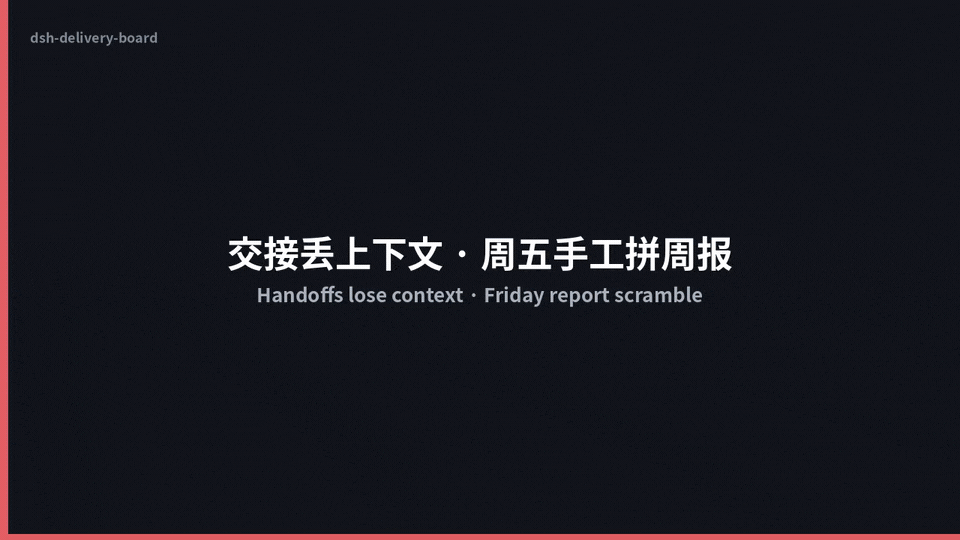
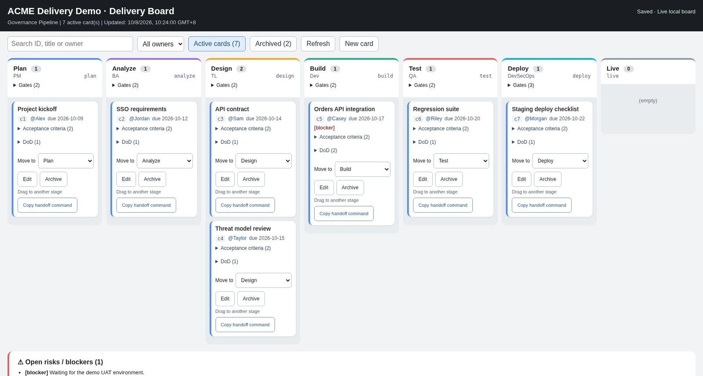
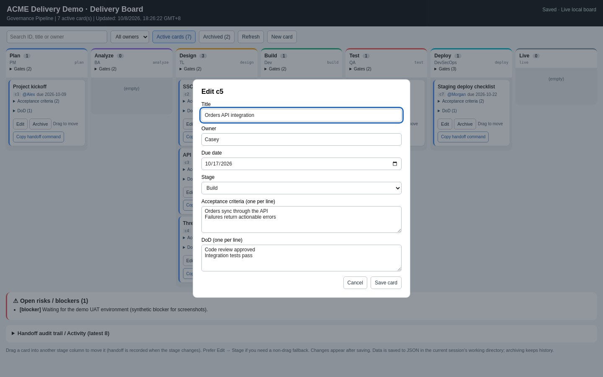
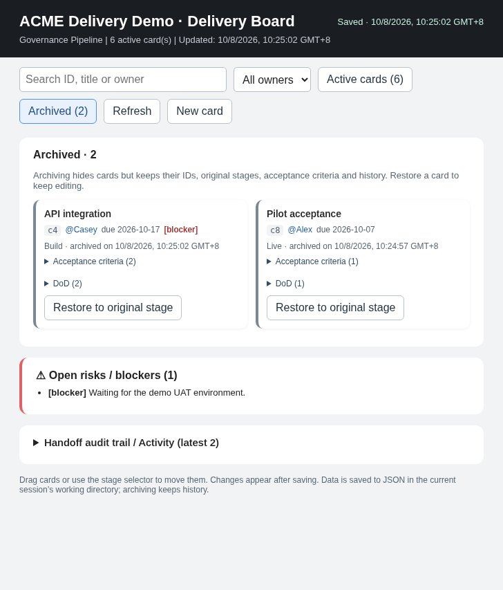

# dsh-delivery-board

[English](README.md) · [中文](README.zh.md)

Work gets handed from analysis to design to development to QA, and context gets lost at every handoff: who owns it now, what "done" means, what is still blocked. Then every Friday someone copies the client weekly report together by hand.

**dsh-delivery-board** is a [DeepSeek Harness](https://github.com/deepseek-ai/deepseek-harness) (`dsh`) plugin that keeps the delivery board, the handoff trail and the weekly report in one `delivery.json` inside your repo.

```bash
dsh plugin --profile web add github:jerryxff26-alt/dsh-delivery-board
```

Desktop app: install the same GitHub spec, `github:jerryxff26-alt/dsh-delivery-board`, from the plugin manager. (The CLI command above is the verified path; the desktop plugin-manager flow has not been separately verified.)

Tested with DSH **0.2.0-rc.2** (developer preview). No runtime dependencies.

## Demo



*~20s silent walkthrough (synthetic demo data). [MP4](docs/demo/demo.mp4) available if you prefer download over the inline GIF.*


## What you get

- **Stage pipeline + cards** — each card has an owner, due date, acceptance criteria and Definition of Done (DoD).
- **Handoff audit trail** — moving a card to another stage records who handed what to whom, automatically.
- **Weekly report** — a Markdown client report: pipeline snapshot, this week's handoffs, open risks/blockers.
- **Local editable board** — `/delivery open` serves a drag-and-drop board on `127.0.0.1` that saves back to the same JSON. Archive/restore keeps history.
- **Offline HTML snapshot** — a single read-only file teammates without DSH can open.



<details>
<summary>Card editor and archive views</summary>





</details>

*Screenshots use synthetic demo data in a local browser fixture.*

## Usage

Type `/delivery` in DSH to run commands directly (no model call). `delivery_board` etc. are the model-facing tool names; the slash command is `/delivery`.

```text
/delivery help
/delivery init {"customer":"Demo","template":"governance"}
/delivery card {"title":"API integration","stage":"build","owner":"Alice"}
/delivery board
/delivery open
/delivery move c1 test
/delivery update {"card_id":"c1","owner":"Bob","due":"2026-10-20"}
/delivery archive c1
/delivery restore c1
/delivery weekly 2026-10-05
/delivery html
```

`/delivery board --archived` includes archived cards. `init`, `card`, `update` and `log` take JSON objects; `move` also accepts JSON for owner changes and handoff notes.

Or just ask in plain language:

- "Set up a delivery project for ACME with the governance template" → `delivery_init`
- "Add a card in Analyze: SSO login, acceptance criteria: SSO supported, owner: Carol" → `delivery_card`
- "Hand off c1 to Design, new owner: Dave" → `delivery_move` (records a handoff)
- "Show the delivery board" → `delivery_board`
- "Open the editable board" → `delivery_open`
- "Generate the HTML board" → `delivery_board_html`
- "Generate the client weekly report" → `delivery_weekly`

`delivery_init` does not call a model: it copies a template (or your custom `stages`), validates it and creates an empty project.

## Pipeline templates

| Template | Stages | Gates |
|---|---|---|
| `default` (ToB Delivery Pipeline) | Client Requirements → BA Analysis → TL Design → Development → Testing → DevSecOps Launch → Live | 1–2 per stage (e.g. acceptance criteria frozen, security scan passed) |
| `governance` (Governance Pipeline) | Plan → Analyze → Design → Build → Test → Deploy → Live | Quality / risk / security sign-offs (e.g. rollback plan ready) |

Fully custom stages are supported via the `stages` parameter. Gates are display-only (human-confirmed) in v0.1.

## Tools

| Tool | What it does |
|---|---|
| `delivery_init` | Initialize a project (customer + template or custom stages) |
| `delivery_card` | Add a card: title, stage, owner, due date, acceptance criteria, DoD |
| `delivery_move` | Move a card to another stage (records a handoff; owner can change). Same-stage owner changes are recorded as a decision, not a handoff |
| `delivery_board` | Quick text board; excludes archived cards unless requested |
| `delivery_open` | Editable local board URL (drag, create/edit, archive/restore) |
| `delivery_update` | Edit title, owner, due, acceptance and DoD without moving |
| `delivery_archive` | Hide a card without deleting data/history |
| `delivery_restore` | Return an archived card to its original stage |
| `delivery_board_html` | Read-only standalone HTML snapshot |
| `delivery_log` | Log progress / risk / blocker / decision |
| `delivery_weekly` | Client weekly report (Markdown) |

## Editable local board vs offline HTML

- `/delivery open` returns a URL. Drag cards between stages (or use the stage dropdown), create/edit cards, archive/restore. Saves go to the same workspace JSON and audit history.
- The live server starts on demand, binds only to `127.0.0.1` on an ephemeral port and uses an unguessable capability path. Treat the URL as private to your machine; it expires when the plugin unloads or DSH exits.
- If another tab, command or external edit changes the JSON, a stale page cannot silently overwrite it: press **Refresh** and retry (conflict protection, not live sync).
- `/delivery html` writes a read-only `.html`/`.htm` file with search, owner filter and archive view; it cannot overwrite the data file.

## Team collaboration

Commit `delivery.json` to the team's shared git repo; `git pull`/`push` is the sync. Concurrent edits still need normal Git conflict review. Each stage renders up to 30 cards initially with **Load more**; search and owner filters cover the whole file.

## Development

```bash
npm install
npm run check
npm test               # domain, HTML, commands, storage, HTTP and plugin tests (real SDK from npm)
npm run test:desktop   # optional: runs plugin tests against an installed macOS desktop app's SDK
```

Local desktop development (macOS, tested with DSH 0.2.0-rc.2):

```bash
DSH_CLI="/Applications/DeepSeek Harness.app/Contents/Resources/runtime/cli/bin/dsh"
"$DSH_CLI" plugin --profile desktop add "link:$PWD" --offline --ignore-scripts
```

Fully quit and reopen DSH after installing or changing a linked plugin, then check **Plugins → dsh-delivery-board** shows **Running**. `--dump-config` works for CLI-managed profiles such as `web`, not for the desktop profile. Set `DSH_DESKTOP_APP` if the app lives elsewhere.

Implementation notes:

- Plugin contract `name / inject / Config / apply`; tools via `defineTool`. Tool output renderers return `ContentBlock[]`.
- Domain logic (`lib/delivery.js`) and the HTML renderer (`lib/board-html.js`) are pure functions; all writes go through `lib/store.js` and `ctx.fs`.
- Weekly handoffs cover seven local-calendar days starting at `week_start` (default: Monday of the current week). Risks/blockers are cumulative (no resolution status yet).
- User content in HTML is escaped (covered by tests).

## Roadmap

- Embed the editable board inside DSH instead of a local URL
- Enforced gate checklists, multi-project rollup
- i18n for board, reports and tool messages

## Known limitations

- DSH is a developer preview. Peer range: `@deepseek-ai/dsh-tools >=0.2.0-rc.2 <0.3.0`, `@deepseek-ai/schemastery ~3.18.4`; only 0.2.0-rc.2 has been tested.
- No Gantt scheduling, Jira/Trello integration, automatic bulk archive, enforced gates or realtime multi-user sync.
- Drag/drop and dropdown controls are checked in a local browser harness; no full keyboard/mobile/WCAG claim.

## License

[MIT](LICENSE) © 2026 jerryxff26-alt
